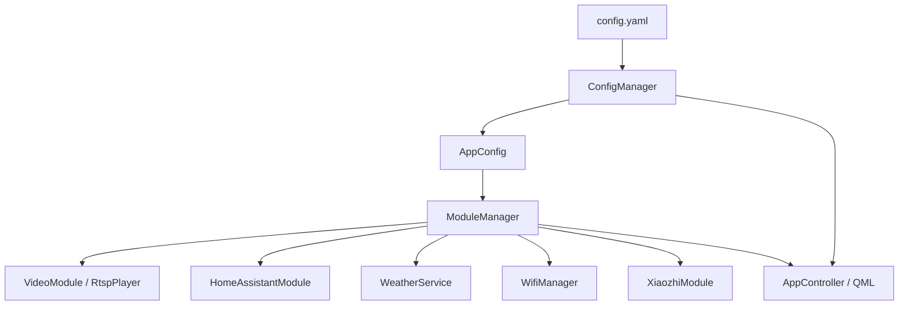
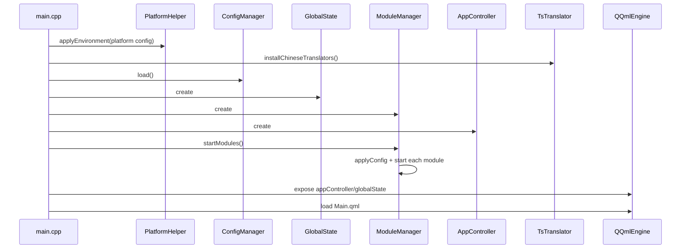
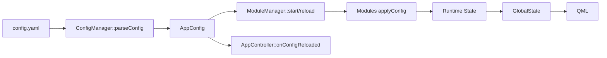
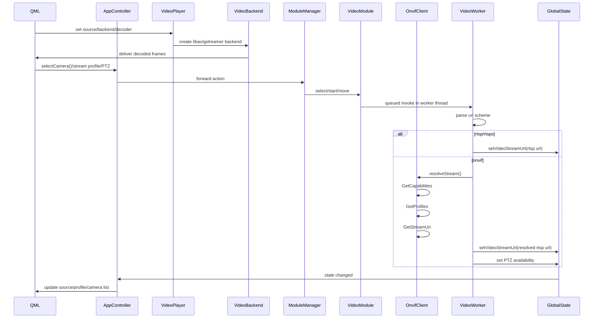
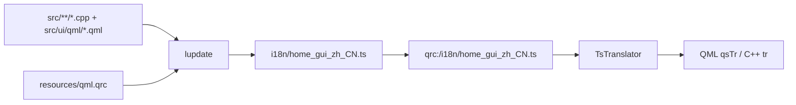
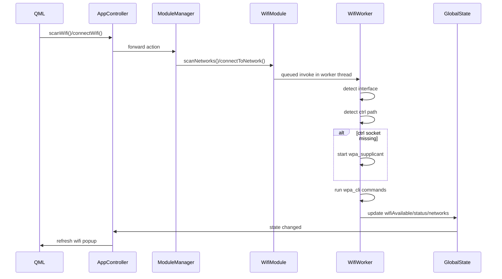
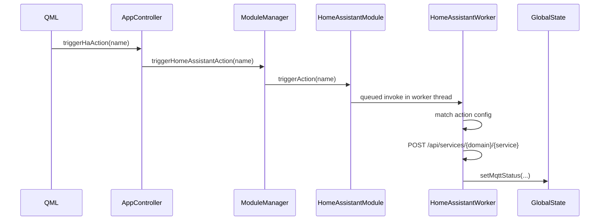

# Home GUI Architecture

本文档说明当前项目的分层、启动流程、配置流向和三个主要业务模块的运行链路。

配置字段、示例和兼容策略请看 [CONFIG_REFERENCE.md](CONFIG_REFERENCE.md)。

## 1. Overall Layers

分层职责：

- **`ConfigManager`**
  负责读取、解析、热重载 `config.yaml`（模板见 `config.yaml.example`）。
- `ModuleManager`
  负责统一创建、启动、停止、重启各业务模块。
- `VideoModule` / `HomeAssistantModule` / `WifiModule`
  负责具体业务协议和设备交互。
- `GlobalState`
  负责保存可直接被前端消费的运行态数据。
- `AppController`
  负责把 `ConfigManager + ModuleManager + GlobalState` 桥接给 QML。
- `QML`
  只负责界面展示和用户交互。
- `TsTranslator`
  从 qrc 内的 `i18n/home_gui_zh_CN.ts` 读取应用中文翻译。

## 2. Startup Flow

关键点：

- 启动前先读一次平台配置，保证 `QT_QPA_PLATFORM` 等环境能在 `QGuiApplication` 之前生效。
- 中文翻译器在 QML 加载前安装，`qsTr()` 和 C++ `tr()` 文案会直接走 `home_gui_zh_CN.ts`。
- 模块在 QML 加载前就会启动，这样界面首屏能直接拿到基础状态。
- `AppController` 不直接持有底层设备逻辑，只负责前端聚合。

## 3. Config Flow

说明：

- 配置文件只保存“外部输入参数”。
- 运行期探测结果，例如 ONVIF `profile token`、各类 service URL、Wi‑Fi ctrl socket 路径，都只留在模块内部。
- 这样配置文件保持简洁，也避免用户去维护本应自动发现的字段。
- 具体字段定义、示例和旧配置兼容规则，统一放在 `CONFIG_REFERENCE.md`。

## 4. Video Flow

### 4.1 Camera URL conventions

- `rtsp://host:554/path`
- `rtsps://host:322/path`
- `onvif://host:port`
- `onvif://host:port/custom/device_service`

约定：

- `rtsp://` / `rtsps://` 代表直接拉流。
- `onvif://` 代表先通过 ONVIF 探测真实 RTSP 流地址。
- 更完整的配置写法见 `CONFIG_REFERENCE.md`。

### 4.2 Video runtime flow

说明：

- `VideoPlayer` 负责播放器生命周期，`VideoBackend` 负责实际解码，UI 不直接调用解码库。
- 当前默认后端是 `libav`；`gstreamer` 后端用于后续 RK 硬解扩展。
- `CameraPopup` 中的预览和主播放都走 `VideoItem`，但每个画面各自持有播放器实例。
- `VideoWorker` 运行在独立线程，避免 ONVIF SOAP 请求阻塞主线程。
- `OnvifClient` 是独立协议客户端，负责 ONVIF SOAP、Profile 选择、StreamUri 解析和 PTZ 请求。
- 配置中的 `url` 是唯一摄像头入口。
- ONVIF 主/辅码流通过 `onvifProfile` 选择；界面切换后写回当前摄像头配置。
- PTZ 可用性来自 ONVIF 探测结果，不再依赖配置写死。

## 5. Localization Flow

维护规则：

- 所有界面固定使用中文环境，`main.cpp` 会安装 Qt 自带 `qt_zh_CN` 和应用 `home_gui_zh_CN.ts`。
- 新增 UI 文案时使用 `qsTr()`；新增 C++ 状态文案时使用 `tr()`。
- 同步翻译源使用 `lupdate -no-obsolete src resources/qml.qrc -ts i18n/home_gui_zh_CN.ts`。
- 翻译文件提交前必须确认没有 `type="unfinished"` 或 `type="vanished"`。
- 配置文件里的显示名，例如 `cameraName` 和 HA `actions[].name`，不是翻译系统处理范围，应直接写成目标展示语言。

## 6. Wi-Fi Flow

启动策略：

- 如果 `wifi.ssid` 有值，优先按配置连接。
- 如果 `wifi.ssid` 为空，执行 `wpa_cli reconnect` 恢复上次连接。

内部自动探测：

- Wi‑Fi 接口名
- `wpa_supplicant` ctrl path
- `wpa_supplicant.conf` 路径

## 7. Home Assistant Flow

说明：

- 当前 HA 走 REST API，不是 MQTT。
- `GlobalState` 里沿用了 `mqttStatus` 这个字段名来展示 HA 状态，后续如果要更清晰，可以改名为 `integrationStatus` 或单独拆出 `haStatus`。

## 8. Key Files

- [src/main.cpp](../src/main.cpp)
  启动入口、翻译器安装、QML 暴露。
- [src/core/tstranslator.cpp](../src/core/tstranslator.cpp)
  `.ts` 翻译文件加载器。
- [i18n/home_gui_zh_CN.ts](../i18n/home_gui_zh_CN.ts)
  应用中文翻译表。
- [src/core/configmanager.cpp](../src/core/configmanager.cpp)
  配置解析与热重载入口。
- [src/core/modulemanager.cpp](../src/core/modulemanager.cpp)
  模块生命周期管理。
- [src/core/globalstate.h](../src/core/globalstate.h)
  运行态数据总线。
- [src/ui/appcontroller.cpp](../src/ui/appcontroller.cpp)
  前端桥接层。
- [src/modules/video/videomodule.cpp](../src/modules/video/videomodule.cpp)
  视频模块编排：RTSP 直连、ONVIF 解析结果接入和 PTZ 状态转发。
- [src/modules/video/onvifclient.cpp](../src/modules/video/onvifclient.cpp)
  ONVIF 协议客户端：SOAP 请求、Profile/StreamUri 解析和 PTZ 命令。
- [src/modules/video/videoplayer.cpp](../src/modules/video/videoplayer.cpp)
  视频播放器生命周期和后端切换。
- [src/modules/video/backends/libavvideobackend.cpp](../src/modules/video/backends/libavvideobackend.cpp)
  libav 解码后端。
- [src/modules/video/backends/gstreamervideobackend.cpp](../src/modules/video/backends/gstreamervideobackend.cpp)
  GStreamer 解码后端。
- [src/modules/wifi/wifimodule.cpp](../src/modules/wifi/wifimodule.cpp)
  Wi‑Fi 扫描、连接、恢复流程。
- [src/modules/homeassistant/homeassistantmodule.cpp](../src/modules/homeassistant/homeassistantmodule.cpp)
  Home Assistant REST 控制。

## 9. Recommended Follow-up

- 给 `VideoModule` 增加明确的“探测失败原因”枚举，而不只是状态文本。
- 给 `WifiModule` 增加删除网络、隐藏 SSID、错误码分类。
- 如果模块继续增加，建议把 `ModuleManager` 的注册逻辑抽成模块工厂。
- 完善 `HomeAssistantModule` 的重连策略，支持指数退避。
